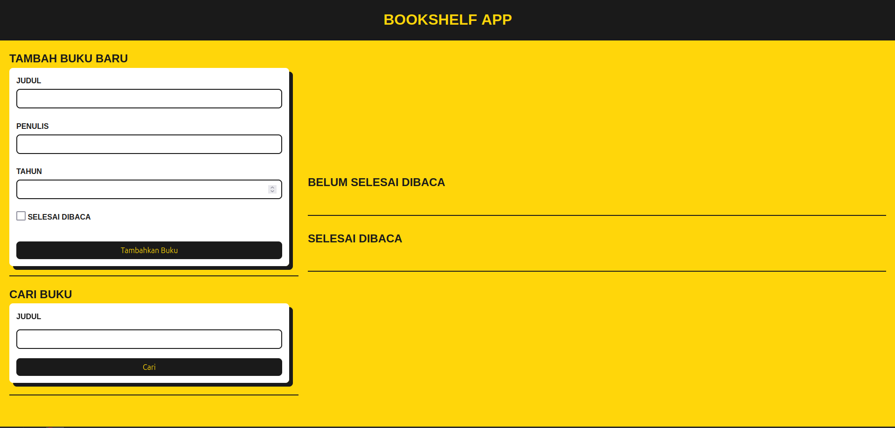
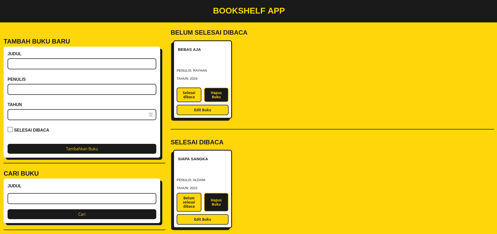
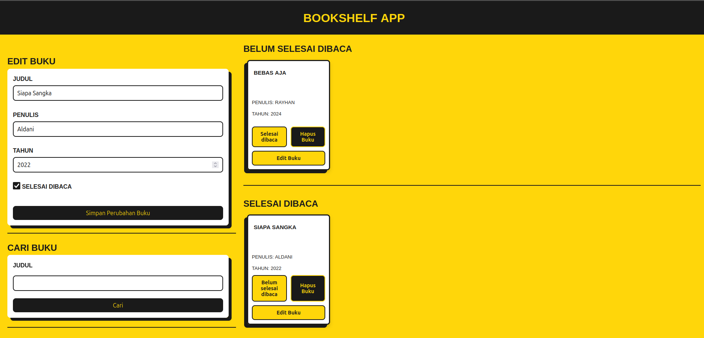

# 📚 Bookshelf App

Selamat datang di **Bookshelf App**! Ini adalah proyek submission dari kelas **Front-End Pemula** yang diselenggarakan oleh **Dicoding Indonesia**. Proyek ini bertujuan untuk mengimplementasikan konsep-konsep dasar yang telah dipelajari, seperti manipulasi DOM, event listener, dan penggunaan **Local Storage**.

## 🎯 Apa itu Bookshelf App?

Bookshelf App adalah aplikasi sederhana yang memungkinkan pengguna untuk menambah, mencari, dan mengelola daftar buku yang sedang dibaca maupun yang sudah selesai dibaca. Proyek ini didesain sebagai latihan pengembangan front-end menggunakan **HTML**, **CSS**, dan **JavaScript**.

## 🌐 Live Demo

Proyek ini dapat dicoba secara langsung melalui link berikut: [Bookshelf App](https://bookshelf-app-aldani.vercel.app/)

## 🖼️ Screenshot Aplikasi

1. **Homepage**:
   
2. **Daftar Buku**: Menunjukkan daftar buku yang telah diorganisir.
   
3. **Fitur Edit & Hapus**: Ilustrasi penggunaan fitur pengelolaan buku.
   

## ⚙️ Fitur Utama

- **Tambah Buku Baru**: Pengguna dapat menambahkan buku dengan detail judul, penulis, tahun, dan status (selesai/belum selesai dibaca).
- **Cari Buku**: Fitur pencarian berdasarkan judul buku.
- **Daftar Buku**: Buku-buku dikelompokkan menjadi dua kategori: selesai dibaca dan belum selesai dibaca.
- **Edit & Hapus Buku**: Memungkinkan pengguna untuk memperbarui informasi buku atau menghapusnya dari daftar.

## 🚀 Cara Menjalankan Proyek

1. **Clone Repo**: Unduh proyek ini ke komputer Anda.
   ```bash
   git clone https://github.com/aldanirayhan/bookshelf-app-fe-dicoding.git
   ```
2. **Buka di Browser**: Jalankan file `index.html` di browser favorit Anda.

3. **Gunakan Aplikasi**:
   - Isi form untuk menambahkan buku baru.
   - Gunakan fitur pencarian untuk menemukan buku berdasarkan judul.
   - Kelola buku dengan fitur edit dan hapus.

## 📂 Struktur Proyek

```
|-- index.html    # Halaman utama
|-- main.js       # Logika aplikasi
|-- style.css     # Styling aplikasi
|-- assets/       # Folder untuk screenshot atau asset lainnya
```

## 🛠️ Teknologi yang Digunakan

- **HTML**: Struktur halaman web.
- **CSS**: Untuk styling dan tata letak.
- **JavaScript**: Logika aplikasi dan interaksi pengguna.
- **Local Storage**: Menyimpan data secara lokal pada browser.

## 💡 Saran Pengembangan

- **Responsive Design**: Optimalkan tampilan untuk berbagai perangkat.
- **Sorting Buku**: Tambahkan fitur pengurutan buku berdasarkan nama atau tahun.
- **Dark Mode**: Berikan opsi tema gelap untuk pengalaman lebih nyaman.

## 🤝 Kontribusi

Proyek ini dibuat untuk memenuhi tugas submission Dicoding. Namun, jika Anda tertarik untuk mengembangkan lebih lanjut, silakan fork repository ini atau ajukan pull request!

## 📝 Lisensi

Proyek ini dilisensikan di bawah MIT. Anda bebas menggunakannya sesuai kebutuhan.
